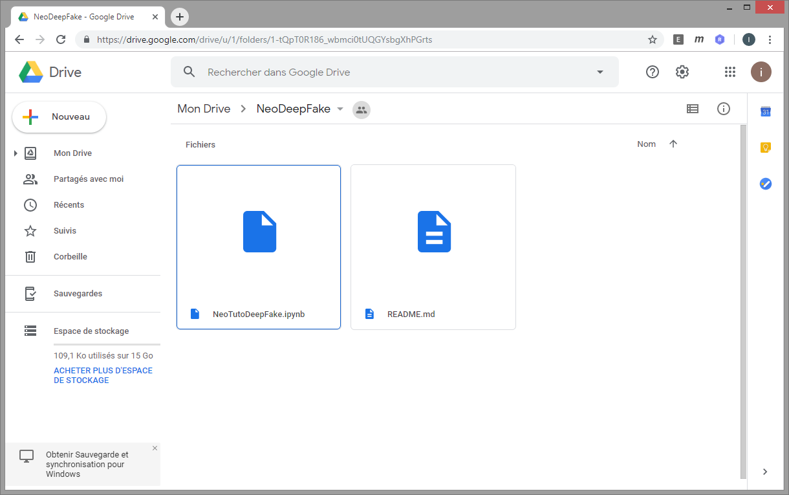

# Tuto DeepFake

Bienvenue sur le tuto DeepFake de Neo-Soft.
Dans ce tuto nous allons voir comment changer le visage d'une personne par une autre dans une vidéo.
Si vous n'êtes pas encore au courant du DeepFake, en voici une petite illustration https://www.youtube.com/watch?v=KWdjnDIo1uo.

Ce site nécessite 1 prérequis : un compte Google Drive !
un peu d'espace disque sur votre compte Google Drive... 2 Go
et, un peu de temps... 20 minutes

readme: https://drive.google.com/open?id=17bW-ukuWYUnY7dThNZhjGTrVDf4ZHxs5
ipynb: https://drive.google.com/open?id=1u7tw5lKkzh6HxPIAag0xKijOkISx3Ptc
Rendez-vous sur https://drive.google.com/drive/u/1/folders/1-tQpT0R186_wbmci0tUQGYsbgXhPGrts si vous n'y êtes pas encore.

La première étape consiste à lancer le tuto dans Google Colab :

Double-cliquer sur le fichier NeoTutoDeepFake.ipynb

Cliquer sur Se connecter

Cliquer sur Ouvrir avec

